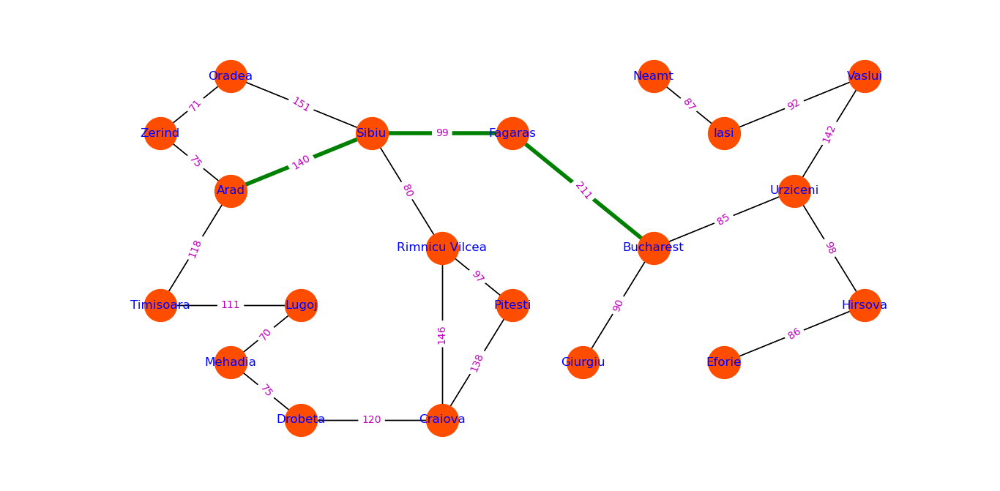

# Route-Planner
Finding Minimum Cost Path

In this project, the A* algorithm is implemented in Python to find shortest path from the city `Arad` to city `Bucharest`. The network (with edge cost) is shown in the figure below and the shortest path is highlighted in green bold line.

